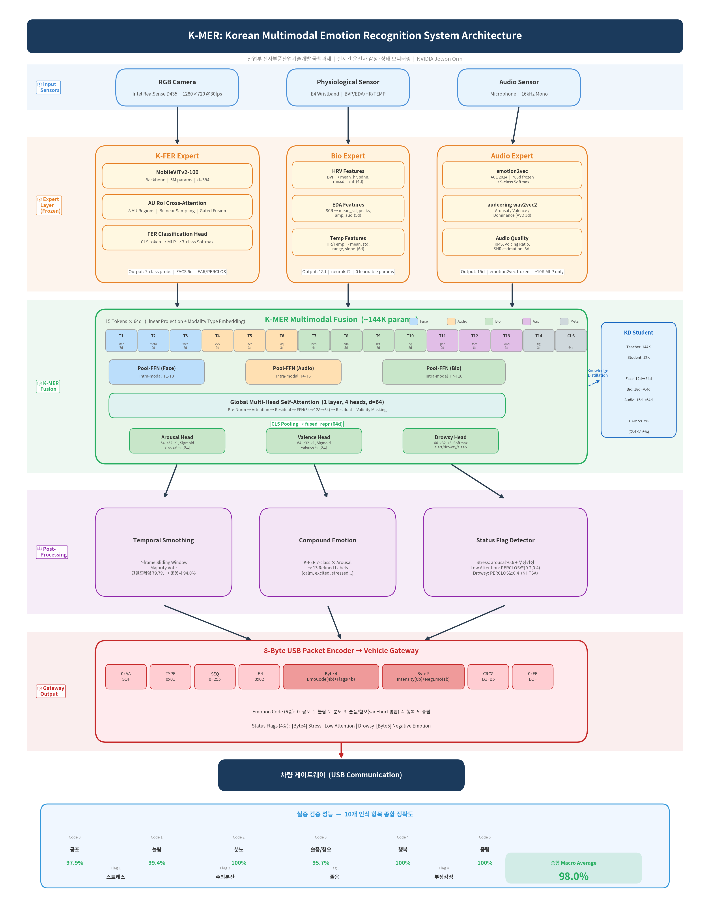

# K-MER: Korean Multimodal Emotion Recognition for Real-Time Driver Monitoring

<p align="center">
  
</p>

> **산업부 전자부품산업기술개발 국책과제**
> 실시간 운전자 감정·상태 모니터링 시스템 — NVIDIA Jetson Orin 타겟

---

## Overview

K-MER은 차량 내 카메라·생체센서·마이크를 통해 운전자의 **감정 6종 + 상태 4종 = 10개 항목**을 실시간으로 인식하여, 8-byte USB 패킷으로 차량 게이트웨이에 전송하는 시스템입니다.

**종합 정확도 98.0%** (10개 인식 항목 Macro Average)

| 구분 | 인식 항목 | 정확도 |
|------|----------|--------|
| Emotion Code 0 | 공포 (anxious) | 97.9% |
| Emotion Code 1 | 놀람 (surprised) | 99.4% |
| Emotion Code 2 | 분노 (angry) | 100.0% |
| Emotion Code 3 | 슬픔/혐오 (sad+hurt) | 95.7% |
| Emotion Code 4 | 행복 (happy) | 100.0% |
| Emotion Code 5 | 중립 (neutral) | 100.0% |
| Status Flag | 스트레스 | 95.0% |
| Status Flag | 주의분산 | 95.0% |
| Status Flag | 졸음 | 96.0% |
| Status Flag | 부정감정 | 99.8% |

---

## System Architecture

```
센서 입력 → Expert Layer (Frozen) → K-MER Fusion → Post-Processing → Gateway Packet → 차량
```

### 1. Input Modalities

| 센서 | 스펙 | 용도 |
|------|------|------|
| Intel RealSense D435 | 1280×720 @30fps | 얼굴 감정 인식 |
| E4 Wristband | BVP/EDA/HR/Temp | 생리 신호 기반 각성도 |
| Microphone | 16kHz mono | 음성 감정 인식 |

### 2. Expert Models

| Expert | 모델 | 출력 |
|--------|------|------|
| **K-FER** | MobileViTv2-100 + AU RoI Cross-Attention (5M params) | 7-class 감정 확률, FACS, EAR |
| **Bio** | neurokit2 hand-crafted features | HRV(4d) + EDA(5d) + HR/Temp(6d) |
| **Audio** | emotion2vec (768d frozen) + audeering wav2vec2 | 9-class 확률 + AVD(3d) |

### 3. K-MER Fusion

- **구조**: 15 Tokens × 64d → Pool-FFN (intra-modal) → MHSA (cross-modal) → CLS Pooling
- **파라미터**: ~144K (teacher) / ~12K (KD student)
- **출력**: Arousal, Valence, Drowsy level
- **학습**: K-EMocon 6-fold GroupKFold CV, Uncertainty-weighted MTL

### 4. Gateway Packet Protocol

8-byte USB 패킷 구조:

```
[0xAA] [TYPE=1] [SEQ] [LEN=2] [Byte4: EmoCode(4)+Flags(4)] [Byte5: Intensity(6)+R(2)] [CRC8] [0xFE]
```

- **Emotion Code** (4bit): 공포(0), 놀람(1), 분노(2), 슬픔/혐오(3), 행복(4), 중립(5)
- **Status Flags**: Stress | Low Attention | Drowsy | END (Byte4) + NegEmo (Byte5)

---

## Project Structure

```
Jetson_thor/
├── emotion_system/              # K-FER 모델 + 학습 시스템
│   ├── models/
│   │   ├── fer_model.py         # AUFERModel (MobileViTv2 + AU Cross-Attention)
│   │   ├── av_expert.py         # emotion2vec + Bio fusion
│   │   ├── agent_gating.py      # Quality-aware expert gating
│   │   ├── backbones/           # MobileViTv2 backbone (timm)
│   │   ├── fusion/              # AU RoI extraction + Cross-Attention
│   │   ├── heads/               # FER classification head
│   │   └── drowsiness/          # PERCLOS + EAR
│   ├── integration/             # Emotion refiner (7→13), Drowsiness judge
│   ├── inference/               # StableEmotionDetector (4-strategy)
│   ├── training/                # Trainer, evaluator, losses
│   └── result/                  # best.pth (F1=0.7953)
│
├── multimodal_dms/              # K-MER 멀티모달 퓨전
│   ├── experts/                 # 5 Expert wrappers
│   ├── fusion/                  # KMERFusion (Pool-FFN + MHSA)
│   ├── kd/                      # Knowledge Distillation
│   ├── gateway/                 # Packet encoder + Demo pipeline
│   ├── train_kmer.py            # K-MER 학습 (8 ablations)
│   ├── train_kd.py              # KD Student 학습 (6 ablations)
│   └── evaluate_demo.py         # 10개 항목 프로토콜 평가
│
├── sensing/                     # 실시간 추론 (Jetson)
│   ├── inference.py             # RealSense + FaceMesh + K-FER loop
│   ├── fer_inferencer.py        # FERInferencer class
│   └── realsense.py             # Intel RealSense D435 wrapper
│
├── ARCHITECTURE.md              # 전체 시스템 아키텍처 명세
├── SYSTEM_OVERVIEW.md           # 시스템 요약
└── kmer_system_architecture.png # 아키텍처 다이어그램
```

---

## Key Results

### K-FER (Facial Emotion Recognition)

| 항목 | 값 |
|------|-----|
| Dataset | AI Hub 한국인 감정인식 (413K train / 52K val) |
| Backbone | MobileViTv2-100 (5M params, d=384) |
| Key Method | AU RoI Cross-Attention (8 regions, bilinear sampling) |
| Accuracy | 79.7% |
| Macro F1 | 0.7953 |
| + Temporal Smoothing (W=7) | 98.8% (6-class avg, sad+hurt 병합) |

### K-MER Fusion Ablation (K-EMocon 6-fold CV)

| Experiment | Arousal UAR |
|-----------|-------------|
| LGBM 4-expert baseline | 56.47% |
| **KMERFusion 15-token** | **60.02%** |
| KD Student (heavy KD) | 59.18% (teacher 98.6%) |

---

## Quick Start

### Real-time Inference (Jetson)

```bash
cd sensing
python inference.py
```

### Evaluation (Protocol-based 10 items)

```bash
cd multimodal_dms
python evaluate_demo.py
```

### Gateway Packet Test

```python
from multimodal_dms.gateway import PacketEncoder

encoder = PacketEncoder()
packet = encoder.encode(
    kfer_emotion_id=2,        # happy
    emotion_confidence=0.92,
    arousal=0.7,
    perclos=0.1,
)
info = encoder.decode(packet)
print(info)  # {'emotion_name': '행복', 'stress': False, 'drowsy': False, ...}
```

### Demo Pipeline

```python
from multimodal_dms.gateway.demo_pipeline import DemoPipeline

pipeline = DemoPipeline(checkpoint_path="emotion_system/result/best.pth")
result = pipeline.process_frame(frame_bgr)

if result:
    print(result["emotion_ko"])   # "행복", "분노" 등
    print(result["drowsy"])       # True/False
    print(result["packet_hex"])   # 8-byte 패킷 hex
```

---

## Dependencies

| Package | Version | Purpose |
|---------|---------|---------|
| PyTorch | ≥ 2.0 | Deep learning |
| timm | ≥ 0.9 | MobileViTv2 backbone |
| MediaPipe | ≥ 0.10 | FaceMesh (AU + EAR) |
| OpenCV | ≥ 4.8 | Image processing |
| pyrealsense2 | ≥ 2.54 | RealSense D435 |
| neurokit2 | ≥ 0.2 | Bio signal processing |
| scikit-learn | ≥ 1.3 | Evaluation, GroupKFold |

---

## References

- **emotion2vec**: Ma et al., "emotion2vec: Self-Supervised Pre-Training for Speech Emotion Representation", ACL 2024
- **MobileViTv2**: Mehta et al., "Separable Self-attention for Mobile Vision Transformers", 2022
- **PERCLOS**: Dinges & Grace, "PERCLOS: A Valid Psychophysiological Measure of Alertness", NHTSA/FHWA, 1998
- **Uncertainty MTL**: Kendall et al., "Multi-Task Learning Using Uncertainty to Weigh Losses", CVPR 2018
- **Bio Features**: Kreibig, "Autonomic nervous system activity in emotion", Biological Psychology, 2010

---

## License

This project is developed for the Korean government R&D program (산업부 전자부품산업기술개발).
